# Taller Traefik

- **Cristian Andrés Basto Largo - 202010495**

## Punto 1: Topología y redes

### Diagrama simple

Traefik --(red appnet)--> API (Express)
└-> Neo4j (solo interno, sin exponer al host)

### Hosts usados
- api.localhost
- ops.localhost

### Comprobaciones

docker-compose.yml: 

``` 
services:
  traefik:
    image: traefik:v3.0
    container_name: traefik
    command:
      - "--api.dashboard=true"
      - "--providers.docker=true"
      - "--entrypoints.web.address=:80"
    ports:
      - "80:80"
    volumes:
      - /var/run/docker.sock:/var/run/docker.sock:ro
    networks:
      - appnet

  neo4j:
    image: neo4j:5.20
    container_name: neo4j
    environment:
      - NEO4J_AUTH=neo4j/test12345
    volumes:
      - neo4j_data:/data
      - ./imports:/imports
    networks:
      - appnet

  api:
    build: ./backend
    container_name: api
    environment:
      - NEO4J_URI=bolt://neo4j:7687
      - NEO4J_USER=neo4j
      - NEO4J_PASSWORD=test12345
      - EXPRESS_PORT=3000
    networks:
      - appnet
    depends_on:
      - neo4j

networks:
  appnet:

volumes:
  neo4j_data:
```

- [x] Contenedores levantados

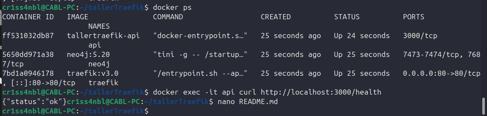

- [x] `curl` dentro del contenedor API responde en `/health` con `{"status":"ok"}`.

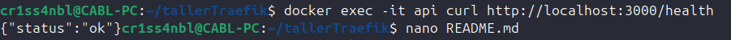

- [x] Neo4j no accesible desde host.

---

## Punto 2: Rutas estructuradas

### Configuración realizada
- Se añadieron entradas en `/etc/hosts`:
  - `127.0.0.1 api.localhost`
  - `127.0.0.1 ops.localhost`

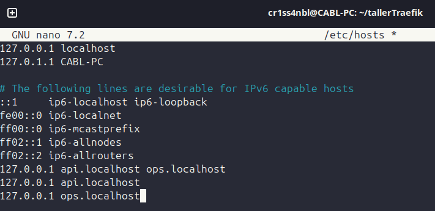

- Se configuraron labels en Traefik para enrutar:stripPrefix pero se sabe que está recibiendo la petición en **ops.localhost/dashboard** pero al pasar el interno sin quitar /dashboard puesda error 404.
  - API → `http://api.localhost/`
  - Dashboard → `http://ops.localhost/dashboard/` Aunque aún no es accesible debido a que no sea ha configurado el 

### Comprobaciones
- [x] `curl http://api.localhost/health` responde con `{"status":"ok"}`.  


- [x] El dashboard responde en `http://ops.localhost/dashboard/` (actualmente 404 hasta aplicar stripPrefix).  

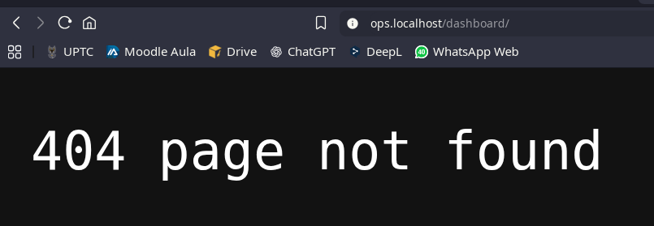

---

## Punto 3: Middlewares

### Cambios realizados

1. **BasicAuth para el Dashboard**
   - Se creó la carpeta `auth/` y dentro el archivo `.htpasswd` con credenciales para proteger el acceso.
   - Se añadieron labels en `docker-compose.yml` para aplicar el middleware `dashboard-auth`.

   ```bash
   # Crear archivo .htpasswd (ejemplo con usuario admin)
   mkdir -p auth
   htpasswd -cB auth/.htpasswd admin
   ```
Luego pide la contraseña para el usuario definido (admin). 

# docker-compose.yml - servicio traefik
```labels:
  - "traefik.http.middlewares.dashboard-auth.basicauth.usersfile=/auth/.htpasswd"
  - "traefik.http.middlewares.dashboard-stripprefix.stripprefix.prefixes=/dashboard"
  - "traefik.http.routers.traefik.middlewares=dashboard-stripprefix,dashboard-auth"
```

2. **stripPrefix para el Dashboard**

- Se configuró stripPrefix para que el dashboard interno funcione correctamente en la ruta /dashboard/.

3. **rateLimit para la API**

- Se añadió un middleware de rateLimit para limitar peticiones.

- Configuración aplicada en docker-compose.yml:

# docker-compose.yml - servicio api
```labels:
  - "traefik.http.middlewares.api-strip.stripprefix.prefixes=/v1"
  - "traefik.http.middlewares.api-ratelimit.ratelimit.average=15"
  - "traefik.http.middlewares.api-ratelimit.ratelimit.burst=30"
  - "traefik.http.routers.api.middlewares=api-strip,api-ratelimit"
```

- Se probó con un bucle curl:

```
for i in $(seq 1 200); do \
  curl -s -o /dev/null -w "%{http_code}\n" http://api.localhost/health & \
done; wait
```
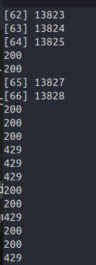

Se ven bastantes 200 pero luego empiezan a aparecer respuestas bloqueadas (429 Too Many Requests).

Se verifica con un curl a *http://ops.localhost/dashboard/*

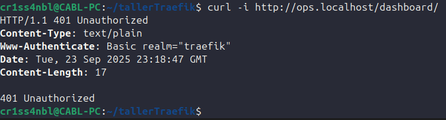

Se ve el 401 Unauthorized debido a que requiere la autenticación del usuario antes de iniciar. Requiere las credenciales.

Se ingresa a la dirección http://localhost/dashboard:

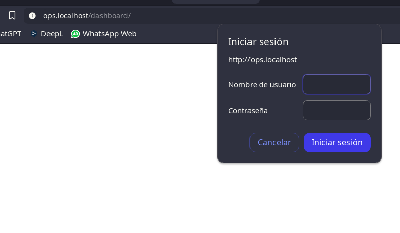

Una vez ingresadas las credenciales correctas ya definidas anteriormente se logra la sesión:

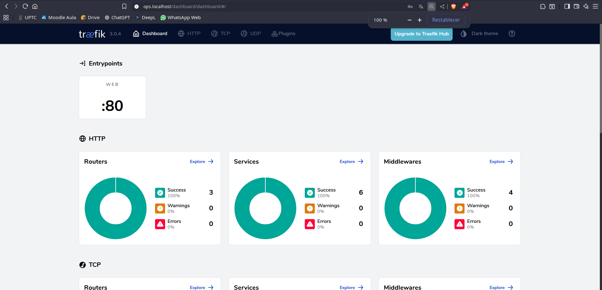

Se miran tanto los routers, services y los middlewares. Confirmar que los detectó Traefik:

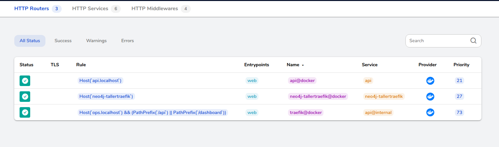
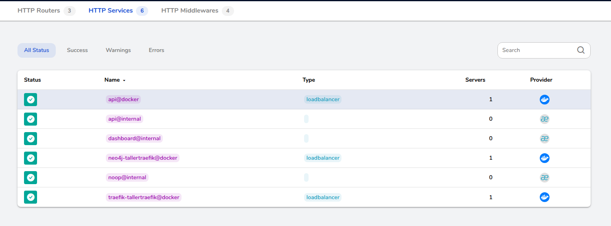
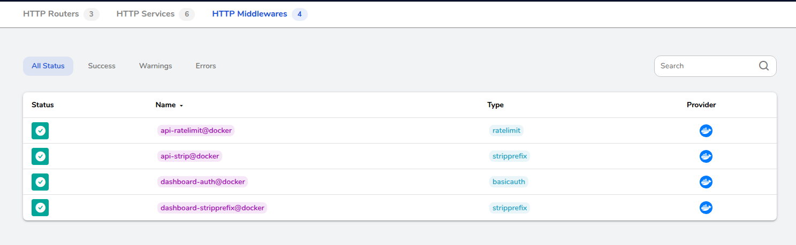

---

## Punto 4: Balanceo de réplicas de la API

### Cambios realizados

- Se elminó container_name del servicio api en docker-compose.yml para permitir múltiples instancias. 
- El endpoint raíz (/) devuelve el *ID del contenedor* (os.hostname()), lo cual permite verificar que la réplica responde.

Se levantan dos instancias de la API -1 y -2. Verificado con el comando:

```for i in $(seq 1 10); do curl http://api.localhost/; echo; done
 ```
Tenemos la salida: 

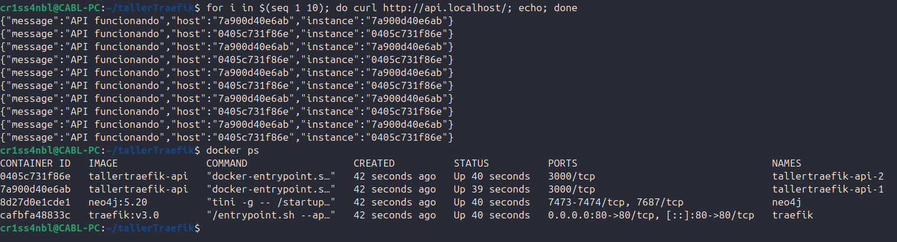

---

## Punto 5: Descubrimiento automático

- La API está configurada con labels de Traefik (routers, middlewares y services) directamente en `docker-compose.yml`.
- No se utilizaron archivos de configuración estáticos.
- Al escalar la API con `--scale`, Traefik detecta automáticamente las nuevas réplicas.

- Se levantaron **2 réplicas de la API** usando:
  ```bash
  docker compose up -d --scale api=2 --build ```

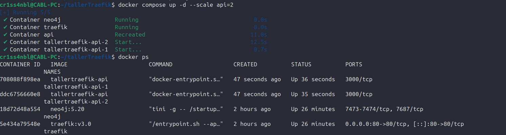

Luego en el Dashboard de Traefik en la sección de Services verificamos que diga en el load balancer que nuestra api docker tiene dos servidores:

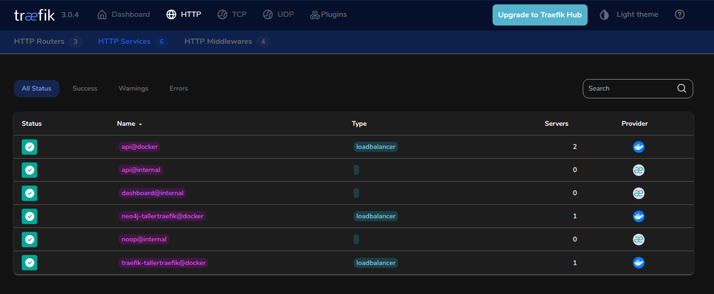

---

## Punto 6: Observabilidad y Pruebas

- Primero verificamos el endpoint de /health en nuestra API:


- Con nuestra base de datos artwork_data.csv que he utilizado en trabajos anteriores se hizo la prueba de listar/crear en nuestra API.

- *Listamos con una petición GET nuestros artworks*

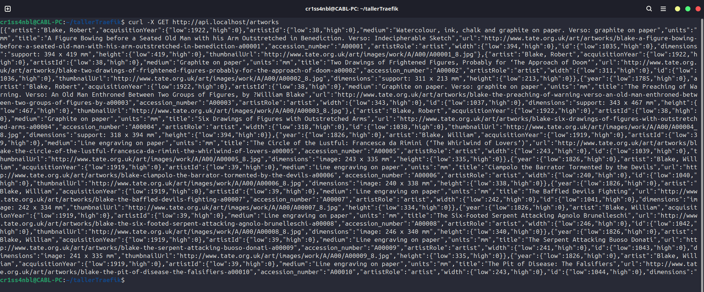

- *Creamos un registro para nuestra base de datos de artistas*

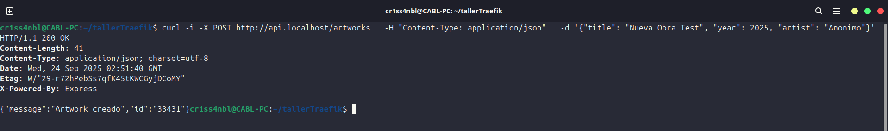

- Solo faltaría comprobar nuevamente el Dashboard de Traefik. 

**Routers**

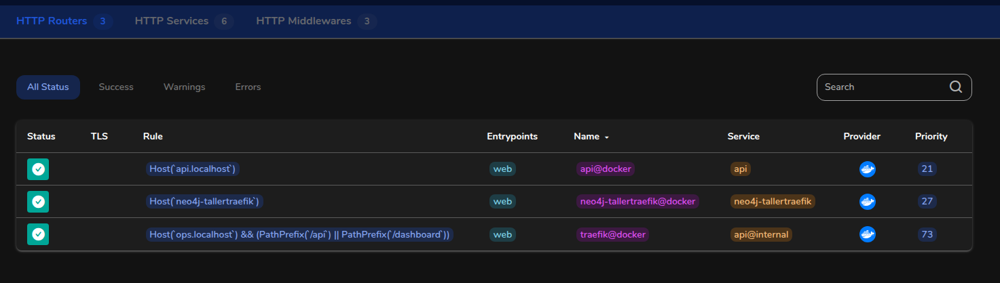

**Services**

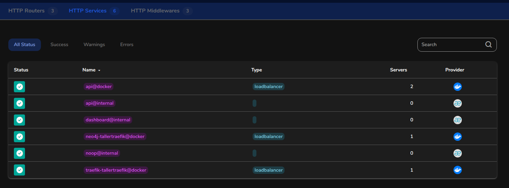

**Middlewares**

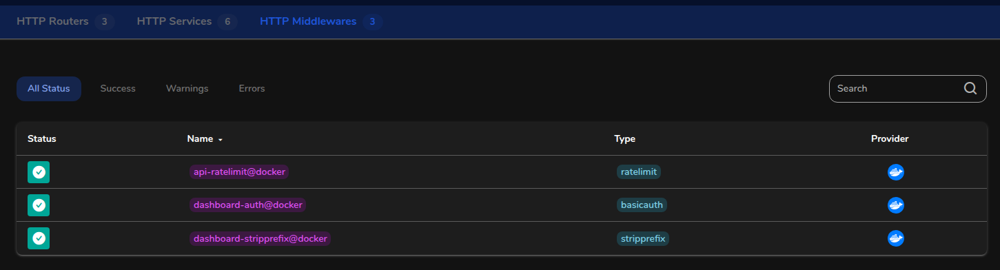

---

## HOST Utilizados:

- http://api.localhost -> API Express conectada a Neo4j

	1. /health -> endpoint de verificación
	2.  /artworks -> Base de datos utilizada para hacer peticiones GET y POST (listar y crear respectivamente)

- http://ops.localhost/dashboard/ -> Dashboard de Traefik protegido con auth básica

---

## Diagrama 

- Diagrama de la solución:

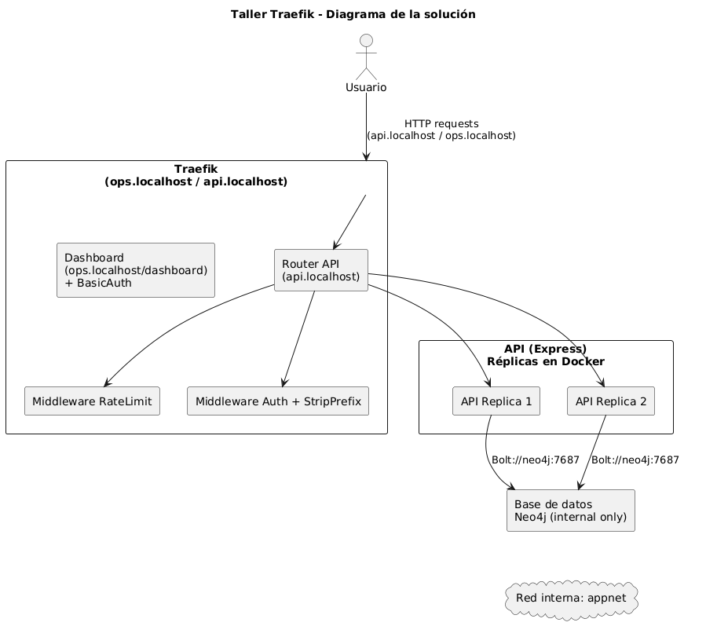

La solución implementada se basa en una arquitectura donde Traefik actúa como gateway de entrada, gestionando el enrutamiento de peticiones hacia la API y el dashboard. Las solicitudes a api.localhost se balancean entre dos réplicas de la API en Express, que a su vez se conectan internamente a la base de datos Neo4j usando la red interna appnet (sin exponer puertos al host). Los middlewares de RateLimit, Auth y StripPrefix se aplican en Traefik para añadir seguridad y control al tráfico. Por otro lado, el dashboard de Traefik se accede únicamente en ops.localhost/dashboard/ y protegido con autenticación básica, evitando accesos inseguros.

---
# Reflexión técnica

**¿Qué aporta Traefik frente a mapear puertos directamente?**
Traefik permite centralizar el enrutamiento de servicios y gestionar múltiples aplicaciones en un mismo host sin necesidad de exponer cada puerto manualmente. Además, ofrece descubrimiento automático de contenedores, balanceo de carga integrado y soporte para middlewares que enriquecen la seguridad y el control del tráfico. Esto simplifica bastante la administración comparado con abrir puertos de cada servicio de manera independiente.

**¿Qué middlewares usaría en producción y por qué?**
En un entorno real usaría BasicAuth (o idealmente un sistema de autenticación más robusto como OIDC) para proteger recursos sensibles, RateLimit para mitigar abusos o ataques de denegación de servicio, y StripPrefix en caso de usar rutas con prefijos en las APIs. Estos middlewares permiten endurecer la seguridad y dar flexibilidad en cómo se publican los servicios hacia los usuarios.

**Riesgos de dejar el dashboard “abierto” y cómo mitigarlos**
Exponer el dashboard sin protección representa un riesgo alto, ya que cualquier persona podría ver la topología de los servicios e incluso descubrir endpoints internos. Esto podría ser aprovechado para ataques dirigidos. Para mitigarlo, se debe proteger siempre con autenticación, exponerlo solo a redes internas, o incluso deshabilitarlo en producción y gestionarlo con archivos de configuración seguros.
